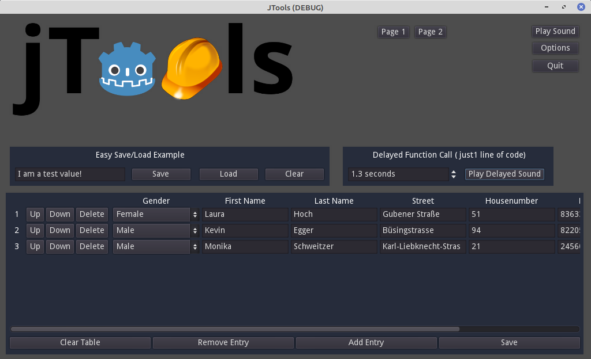
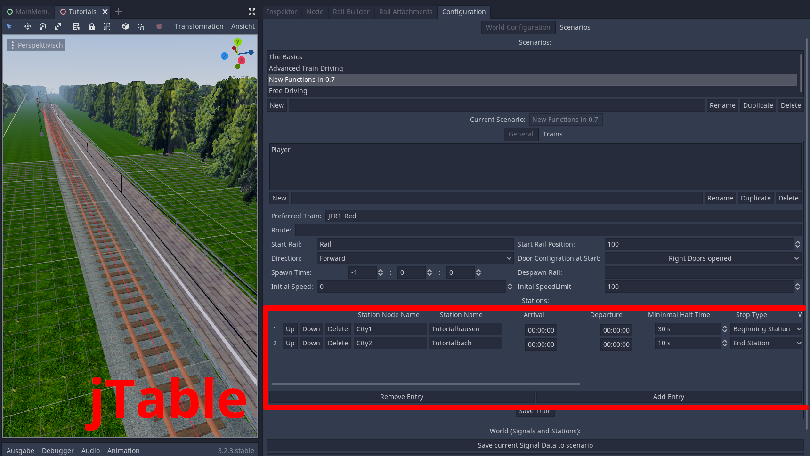
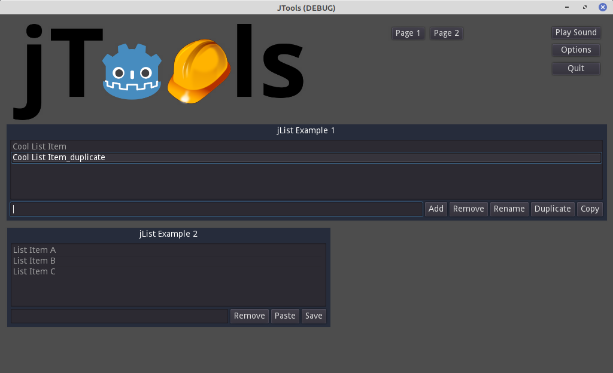
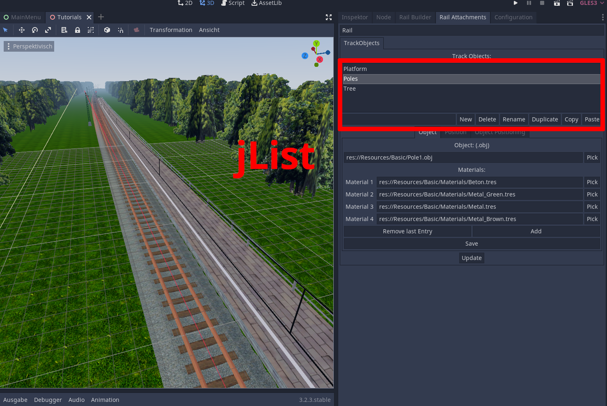
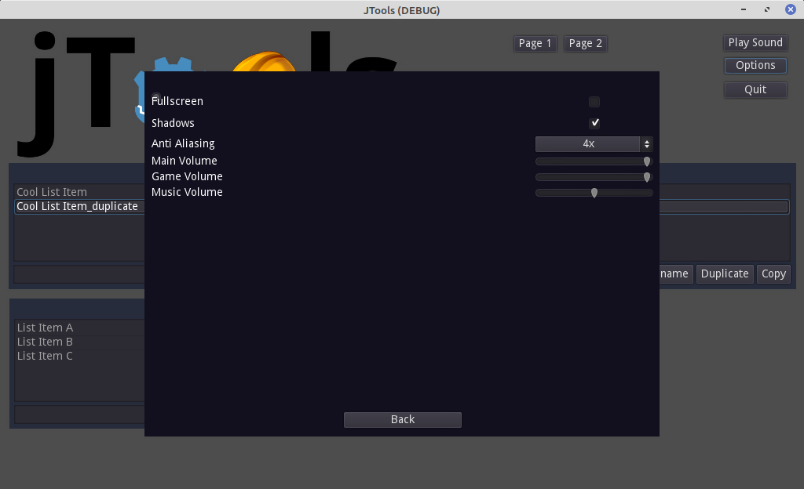
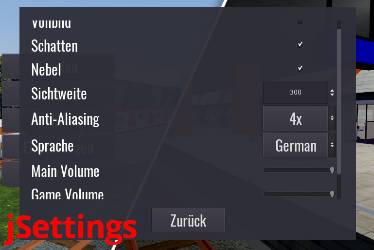

***
Useful toolset for creating games with Godot Engine.
It is intended to expand and modify the toolset on your needs.
It is high customizable and offers a simple, but efficient basis.

You can use this in your own project, even a commercial one.

## Features
- **jSaveManager**: Stores values easily
- **jTable**: Advanced Tables for Godot. For your needs
- **jList**: Adds powerful and customizable lists.
- **jAudioManager**: Play music and sounds with a single line of code. Everywhere.
- **jSettings**: Basic Settings Manager
- **jEssentials**: Simple but efficient functions

## Screenshots
| Examples | jTools in Action |
| ------- | --------- |
|  |  |
|  |  |
|  |  |

## How to use jTools in your own project
Just copy in the addons folder in to your Godot Project.
Then head to the projectsettings -> addons, and activate jTools!

For quick start just look at the provided example.tscn and example.gd how to use them.

**Attention:**
*At game start jAudioManager loads in it's own audio bus layout located in
`res://addons/jean28518.jTools/jAudioManager/jAudoManager_bus_layout.tres`.
You are welcome to expand this layout for your own needs.
If you don't want to use this audio bus layout, set `enable_jAudioManager_bus` in `jConfig.gd:15` to `false`.*

## Modules
If you don't want to use all components of jTools you can deactivate some modules by editing `res://addons/jean28518.jTools/jConfig.gd`.

### jSaveManager
With it you can very easy save values of your game persistently.
In code it can be accessed very easy over `jSaveManager`.
It stores all saved data at `res://jSaveManager.save`. It can be changed in the jSaveManager Script.

#### How to use
- **jSaveManager.save_value(key : String, value):** Stores a value with a specific key.

- **jSaveManager.get_value(key : String):** Gets the value which is stored under that key.
If this value doesn't exist, null is returned.

#### Example
```
jSaveManager.save_value("level", 3)

var level = jSaveManager.get_value("level")
```

#### jSaveModule:
If you need a local jSaveManager e.g. for a specific level, you can insert `res://addons/jean28518.jTools/jSaveManager/jSaveModule.tscn` into your scene. It extends jSaveManager. jSaveModule is faster than jSaveManager because it is using an internal cache.

##### Cache:
- **write_to_disk()**: Writes cache to hard drive. Call is optional, jSaveModule writes to disk automatically.

- **load_everything_into_cache()**: Loads everything from hard drive to cache. After this `get_value()` doesn't need read disk calls anymore.

- **jSaveManager.reload():** Reloads cache of jSaveManager. If you duplicate some values with other objects in it, this function could be usefully.

##### Save Path:

Additionally you can change the path of the save file with `set_save_path(save_path : String)`. That works even ingame.
You can also define the path of the save file in the inspector. The file extension is irrelevant. But make sure to use one. Otherwise some OS could have difficulties with it. Example of a save_path: `res://Levels/Level1/Level1.save`

### jTable
Powerful table for godot. Usable ingame but also for editor plugins.

#### How to use
- Add `res://addons/jean28518.jTools/jTable/jTable.tscn` to your scene.
- Add child nodes to it. These depend on what fields you want to add to the table. If you want to have 3 columns, add 3 child nodes to the table. These could be e.g. Line Edit, Spin Box, Option Button or Check Box.
- In the inspector you have to define the `headings` array. If you want to have 3 columns, then the size of it has to be 3.
- Also you have to define the `keys` array in the inspector. It should be the same size as the headings array. In keys these keys are specified, with wich you can access the values in the retrieved data later.
- You can also specify some more settings in the inspector. In the end press the checkbox "Update Table". If the console don't throw an error, everything worked fine.
- In the end you have to connect the signal "saved_pressed" to a script of you. With that data you can do everything.

If you have problems at any time, check out the `example.tscn` with `example.gd`.

Is some (custom) node type for the jTable missing? No problem! Just edit `res://addons/jean28518.jTools/jConfig.gd` in the section "jTable".

#### Data Structure
You can get the current data of the table by calling `get_data()`. With `set_data(tableData : Dictionary)` you can load data to the table.

In the end it is a Dictionary containing for each value a specific array. If you want to get e.g. the age of the 5th line you have to call `var age = dataTable["age"][4]`

**Example:**
```
var dataTable = {
    "Street": [ "Gubener Straße", "Büsingstrasse", "Karl-Liebknecht-Strasse" ],
    "city": [ "Bad Tölz", "Gilching", "Kaltenkirchen" ],
    "firstName": [ "Laura", "Kevin", "Monika" ],
    "gender": [ 1, 0, 0 ],
    "housenumber": [ "51", "94", "21" ],
    "lastName": [ "Hoch", "Egger", "Schweitzer" ],
    "postalCode": [ 83633.0, 82205.0, 24560.0 ]
}
```

### jList
With it you can integrate an editable list very easily. jList is highly integrateable with your code. It throws signals at every user interaction.

While every user action jList checks its consistency. Also it can handle wrong user actions (e.g. trying to add a entry called `""` is not allowed) and doesn't send signals for these.

#### Setup
Setting up jList is very easy. Add `res://addons/jean28518.jTools/jTable/jTable.tscn` to your scene. See the example.tscn in Page2 how the jLists where Setup.

#### Customization
- **ID**: You can give the jList a unique name, if you want. Over it you can access this jList via `jListManager.get_jList(id : String)` from everywhere in the code. Set it to `_random`, if a random id should be generated.
- **Entry Duplicate Text**: If only unique entries are allowed in this list, this string will be appended after the actual text.
- **Only Unique Entries allowed**: If this one is activated: If an added entry has the same text as an other one in this jList, it will be made unique by appending e.g. `_duplicate` to the new entry
- **Multi Selection Allowed**: If this one is activated the user can select multiple Entries with Ctrl and/or Shift. If this is false, then user can only select one list item at the same time.
- **Custom Font Path**: If set to an appropriate path, the font settings will be overwritten.
- **Update**: If you check this one, the configuration of the Button Configuration will be updated
- **Enable * Button**: Self explainig. Every Button at jList can be activated/deactivated.
    - *(When Add Button is enabled, the user will be able to add by new entries by pressing enter in the edit line)*

#### Access in Code
##### jListManager
Can be accessed from everywhere.
- **jListManager.get_jList(id : String)**: With it a jList can be accessed.
- **jListManager.get_buffer()**: Get the current buffer. It's an array of strings. In it these entries are stored, which the player copied. Theres only one global buffer for all jLists.
- **jListManager.get_buffer_source_jList_id()**: Retrieves the id of the jList, from which the current entries in the buffer come.
- **jListManager.clear_buffer()**: Clears the global buffer.

##### jList Functions
- **get_data**: Retrieves all current entries in a single string array.
- **set_data(entry_names : Array)** Opposite of get_data(). Clears jList before.
- **clear()**: Clears the whole list. Sets the Line Edit Text to `""`.
- **add_entry(entry_name : String)**: Adds an entry to the list. If enty_name already exists in this list, it will be made unique by appending e.g. `_duplicate`. Returns the resulting (unique) entry_name.
- **remove_entry(entry_name : String):** Self explaining. Does nothing if entry_name wasn't found in this list.
- **has_entry(entry_name : String):** Self explaining. Returns a bool.
- **select_entry(entry_name : String):** Selects an entry. The users sees the selected entry in the end.
- **get_size()** Returns the current size of the list.
- **revoke_last_user_action(message : String = "")**: You can revoke the last user action. So if the user does something illegal for you, you can revoke this, and display optionally an popup Message. This function does not emit any signals.

##### jList Signals
With these signals you can integrate jList very easy to your current enviorment.

Signals are just emitted, if the user itself does something. While calling functions via code no signals are emitted.

- **user_added_entry(entry_name : String)**
- **user_removed_entries(entry_names : Array)** (array of strings)
- **user_renamed_entry(old_name : String, new_name : String)**
- **user_duplicated_entries(source_entry_names : Array, duplicated_entry_names : Array)** (arrays of strings)
- **user_copied_entries(entry_names : String)**
- **user_pasted_entries(source_entry_names : Array, source_jList_id : String, pasted_entry_names : Array)** (arrays of strings)
- **user_pressed_save(data : Array)** (array of strings, data is equal to entry_names)
- **user_selected_entry(entry_name : String)**: This signal only emits, if the user selects ONE entry.
- **user_pressed_action(source_entry_names : Array)**: This signal emits, if the user selected one or more entries anc pressed the action button. At the list itself nothing changes. You can use this for your own custom action/function you want to implement. For example the function to open a list item.

### jAudioManager
Play easy sounds by calling just one function from anywhere. Music even keeps playing while switching to another scene.

If you want you could define specific game and music bus ids in the jConfig.gd file.

#### How to use
- **play_music(soundPath : String, loop : bool = true, volume_db : float = 0.0)** Plays music from a given path. By default it is looped.

- **play_game_sound(soundPath : String, volume_db : float = 0.0)** Plays simple game sound (no 3D/2D Effects) from a given path. By default it is not looped.

- **play(soundPath : String, loop : bool = false, pausable : bool = true, volume_db : float = 0.0 , bus : String = "Game")** You wanna get advanced? Just use this function.

- **clear_all_sounds():** That's very helpful if you want to change the level for example. That clears the music too.

- **set_main_volume_db(volume : float)** This function is usually called by jSettings. But you can change the volumes too. If you want.

- **set_game_volume_db(volume : float)** This function is usually called by jSettings. But you can change the volumes too. If you want.

- **set_music_volume_db(volume : float)** This function is usually called by jSettings. But you can change the volumes too. If you want.

#### Examples
```
    jAudioManager.play_music("res://addons/jean28518.jTools/example/SampleMusic.ogg")

    jAudioManager.play_game_sound("res://addons/jean28518.jTools/example/SampleSound.ogg")
```

### jSettings
*Currently unfortunately jSettings doesn't offer the comfort you have for example in jList. You can see jSettings as a good template/starting point.*

#### Features:
- Automatic language handling - Just load in the translation files. Rest is done by jSettings.
- Integration with jAudioManager
- AntiAliasing Setting
- Fullscreen Setting
- Integration with jSaveManager
- ...

#### How to use

When you call the function `jSettings.open_window()`. The Settings window opens. Everywhere. The game won't be paused. But the option window also can work while the game is paused.

#### Customization

To add a setting, add some nodes to the GridContainer in `JSettings.tscn`. Then add some code in the `JSettings.gd` at `_ready()`,  `apply_saved_settings()` `update_settings_window()`. Also add your own setter/getter functions in the end of the script. Connect the new nodes in the grid per signals with your set/get functions, if as possible.

If you don't need some setting just hide some entries in the jSettings.tscn.

### jEssentials
It's a collection of simple methods, which make developing a lot cleaner and easier.

- **jEssentials.call_delayed(delay : float, object : Object, method : String, arg_array : Array = [])**: With this function you don't have to use Timers anymore. Just specify the delay in seconds, the object on which the given function should be accessed. In the end you have to create an array with the arguments of the function. Example: `jEssentials.call_delayed(1.5, jSaveManager, "save_value", ["level", 3])`

- **jEssentials.remove_all_pending_delayed_calls()**: Removes all pending delayed calls. Useful, if the user quits the level.

- **jEssentials.find_files_recursively(directory_path : String, file_extension : String)**: With this function you can crawl a directory for a specific file extension. It returns an array of Strings containing the full path of the files. Ignores files beginning with a `.`. *(This function works recursively. Crawling over big directorys could cause lags)* Example: `var scripts = jEssentials.find_files_recursively("res://", "gd")`

- **jEssentials.copy_folder_recursively(from : String, to : String)**: Copies whole folder with all content and subfolders to another location. Overwrites existing files.

- **jEssentials.remove_folder_recursively(path: String)**: Removes all files and all subfolders.

- **jEssentials.remove_duplicates(array : Array)**: Removes duplicates out of the array. Returns the new array without duplicates.

- **jEssentials.show_message(message : String, title : String = "")**: Opens a popup dialog with given message and optional title.

- **jEssentials.does_path_exist(path : String)**: Returns true if at the given path is a directory or a file.

- **jEssentials.crawl_directory_for(directory_path : String, file_extension : String)**: Searches the whole directory with all subdirectories files with given file extesnsion. Returns an array of strings with full paths of found files. Example: `var all_text_files = jEssentials.crawl_directory_for("/home/test", "txt")`

- **jEssentials.get_subfolders_of(directory_path : String)**: Get direct subfolder names of given folder. Returns array of strings.

## Feedback? Found Bugs? Suggestions?:
-> Open an issue at https://github.com/Jean28518/Godot-jTools
